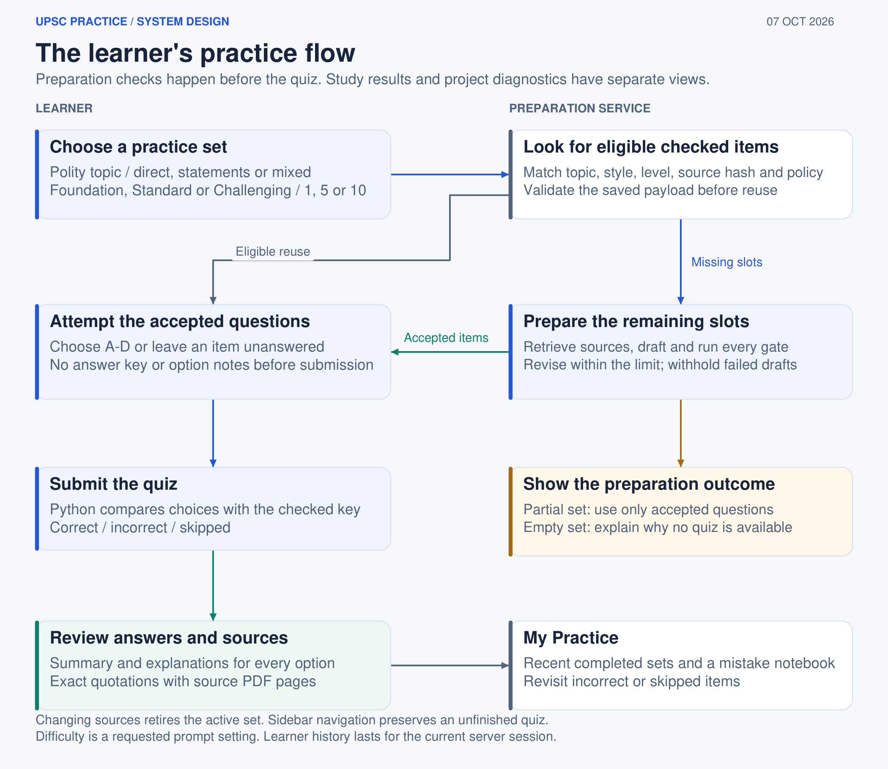

# Design: a source-grounded Polity practice app

## Problem

Learners need to practise UPSC Prelims Polity without being taught an invented constitutional rule. A fluent model can create a plausible stem, a wrong key, ambiguous distractors or explanations that cite a related passage without proving the option. The product therefore separates candidate generation from publication.

The current capstone scope is static Indian Polity. It is not a current-affairs tutor, a web-search agent or a general UPSC answer engine. The initial source snapshot contains the Constitution of India and a selected NCERT Grade 7 chapter. A gap in those sources leads to withholding or a partial set.

## Product behaviour

The learner chooses one of 13 Polity topics, a direct or statement format, a requested difficulty and 1, 5 or 10 questions. Eligible accepted questions are reused. New slots run through a bounded LangGraph workflow. Only accepted records enter the quiz; the key and explanations stay hidden until submission.

## System decisions

Retrieval runs before generation. The local semantic index selects 20 chunks, the cross-encoder reranks them to five, and page-aware context restores qualifications and footnotes. A named constitutional Article can add its operative provision pages; this is evidence collection, not a verdict.

Statement questions are decomposed into complete propositions. A fact reviewer returns SUPPORTED, CONTRADICTED or INSUFFICIENT with quotation references. Python validates the references and maps a fully resolved truth pattern to the option. CONTRADICTED is a valid false statement inside a question; INSUFFICIENT blocks publication.

Direct questions use a separate option-comparison path. It must find exactly one supported option and three ruled-out alternatives, and a blind review must select the same answer. Missing evidence cannot prove that an alternative is false.

The generator's proposed key and prose are untrusted. A quality auditor checks clarity, uniqueness, distractors, wording and topic fit. A fresh notes writer creates a summary and an explanation for each option, then a reviewer checks every note against its selected source excerpts. Python requires all five gates to pass.

## Trade-offs

The design spends more calls and latency to reduce unsupported releases. The local NumPy index is easy to inspect and reproduce, but it is not a production vector service. SQLite is appropriate for a single-user capstone and does not provide account isolation. A fixed workflow is easier to test than an autonomous agent, but cannot discover new sources. Exact quotation binding proves provenance, not legal entailment. Same-family blind reviews can share errors.

## Current evidence

The 16-query retrieval report records 14/16 page hits for both semantic and reranked results in its current saved run. The preserved 13-question verifier reports show selective answering and abstention; the 75-question mixed set is now a regression diagnostic. No independent expert-labeled generated-MCQ accuracy benchmark exists yet. The project does not claim zero factual errors or a 75/75 score.

See docs/SYSTEM_DESIGN.md for interfaces, docs/PRACTICE_DESIGN.md for the learner contract, and EVALUATION.md for historical measurements and their limits.
