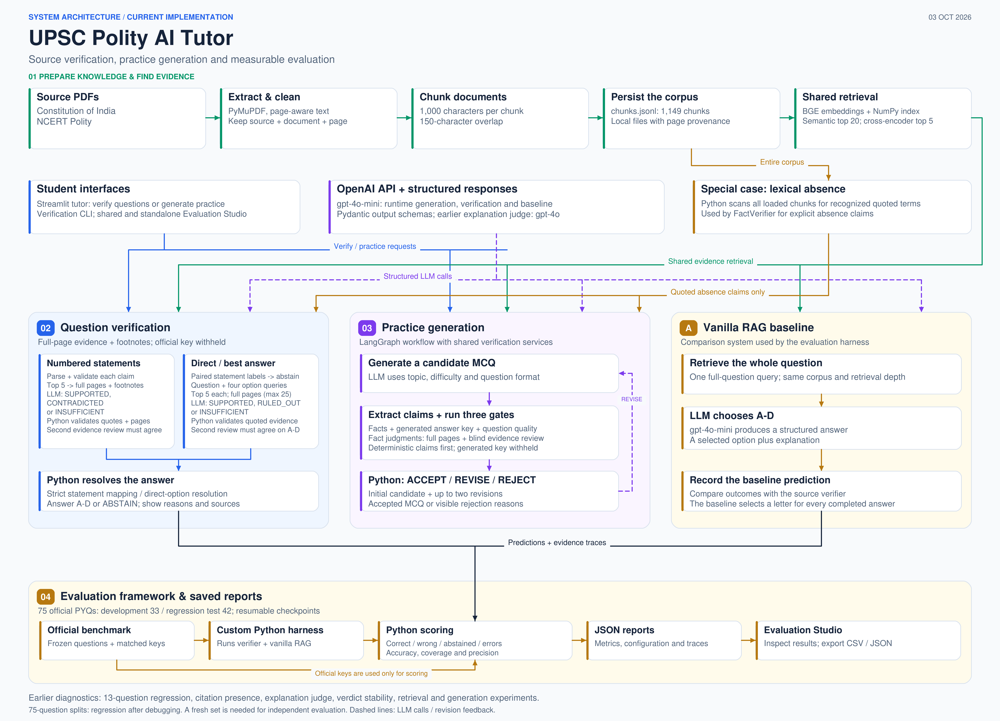
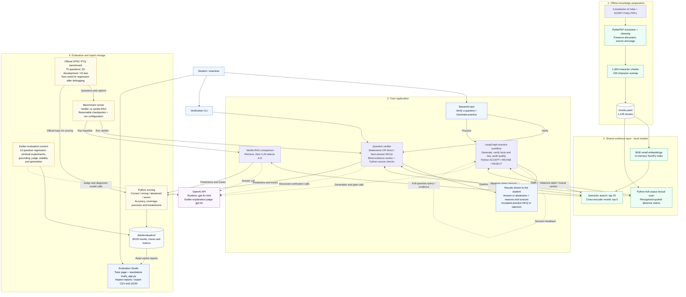
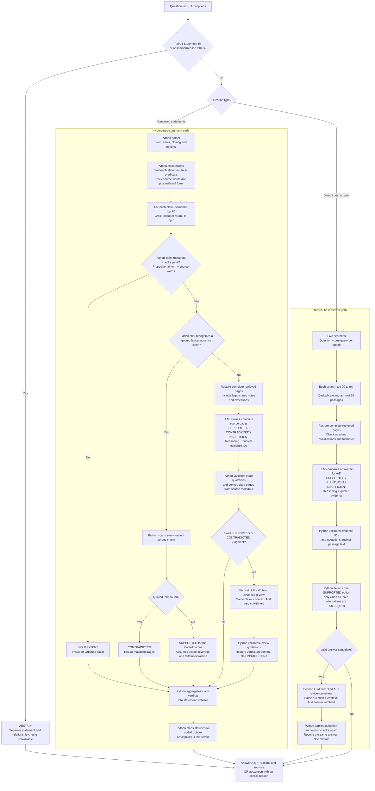
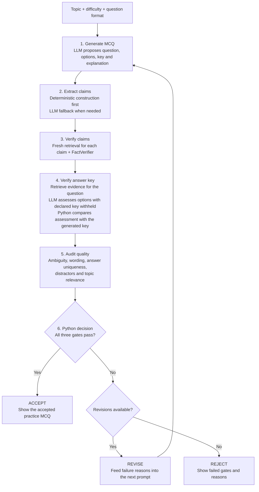
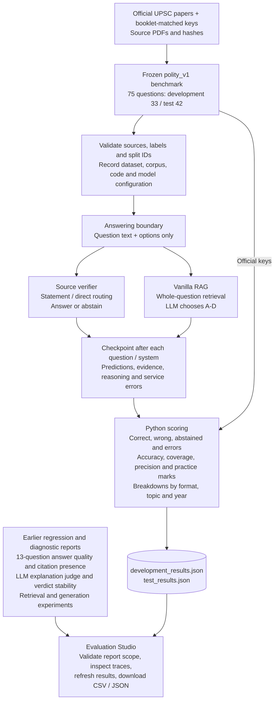
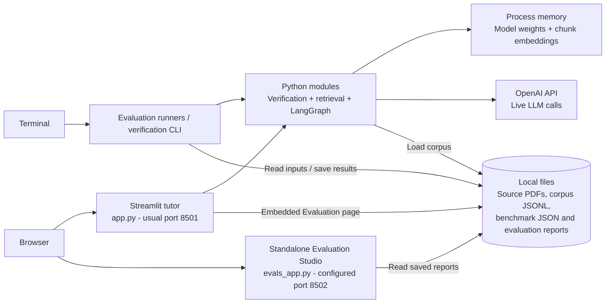

# Overall system design: UPSC Polity AI Tutor

For the current learner app, see the [7 October practice architecture image](diagrams/practice_architecture.png)
and [project brief](PROJECT_BRIEF.md). The diagrams below retain the earlier experiments.

This document describes the implemented project as of **3 October 2026**.
The system verifies existing MCQs, generates and checks practice MCQs, and
compares its answering behaviour with vanilla RAG through a custom evaluation
harness. All three flows use the same Constitution and NCERT corpus.

The [standalone Mermaid source](diagrams/overall-system.mmd) can be opened in a
Mermaid editor for presentation or exported as SVG. The diagrams below explain
the overall architecture and the decisions inside each flow.

Download the presentation image as [PNG](diagrams/system-design.png),
[SVG](diagrams/system-design.svg), or [PDF](diagrams/system-design.pdf).
Regenerate these exports with
`.venv/bin/python docs/diagrams/render_system_design.py`.

## 1. Overall architecture

Solid arrows show prepared data, evidence, results, or a requested workflow.
Double arrows show a query and its result. Dotted arrows show model calls and
revision feedback. These are module interactions; the detailed diagrams below
show execution order.

Read this diagram in four parts:

1. **Prepare knowledge.** Extract PDF pages, clean their text and create chunks
   while retaining source and page metadata. Save the chunks in JSONL.
2. **Find evidence.** Embed the chunks with `BAAI/bge-small-en-v1.5`. A query
   retrieves 20 candidates by normalized embedding similarity. The
   `cross-encoder/ms-marco-MiniLM-L-6-v2` scores query–passage pairs and keeps
   five passages for that query.
3. **Check questions.** The verifier checks claims or answer options against
   the complete retrieved pages, including footnotes. Python validates exact
   source quotations and requires a second blind evidence review for an answer
   candidate. Python resolves the final answer or abstention. The
   practice workflow uses verification gates and revision feedback to decide
   whether to accept a generated question.
4. **Measure outcomes.** Evaluation runners record predictions, evidence and
   errors, score predictions against official keys, and save JSON reports.
   Evaluation Studio reads these reports and offers inspection and exports.

## 2. Existing-question verification

Numbered statements and direct MCQs have different evidence checks. The
question's official answer is withheld from both answering paths.

The current statement callers retrieve evidence before calling `FactVerifier`.
The shared claim guard rejects claims marked non-propositional or containing
unsupported introduced words before a model call. The verifier restores full
page context before a model call. Missing or invalid quotations downgrade a
committed model judgment to INSUFFICIENT. A valid committed judgment needs a
second blind review and agreement on its verdict. Direct answer candidates need
a second valid option analysis selecting the same answer. Both calls use the
same configured model; agreement does not establish statistical independence or
guarantee correctness.

The direct entry points recognize unsupported paired labels before option
retrieval or a model call. They return an explicit abstention for these formats.
Generic option comparisons do not stand in for independent statement and
explanatory-relationship judgments.
For a recognized quoted absence claim, the verifier then uses the full-corpus
lexical scan to return a verdict. Other claims use the retrieved passages in an
LLM verification. This scan addresses literal occurrence of a quoted term; broader
conceptual claims follow ordinary evidence verification.

For example, “there is no mention of the word ‘emergency’ in the loaded corpus”
can be contradicted by a literal occurrence in that corpus. Finding “emergency” in a passage
does not by itself adjudicate a claim such as “the President can declare an
emergency without approval.” That claim requires evidence about the asserted
power and conditions.

The direct path checks whether an option answers the exact question. An option
can describe a true secondary function and still be ruled out for a “chief
purpose” question. Quotation matching verifies where the quoted words came
from; whether those words justify the assessment remains a model judgment.

## 3. Practice generation and verification

The LangGraph workflow carries a shared `MCQVerificationState` through six
nodes. Pydantic models define the generated MCQ and the gate results.

The default budget is **one initial generation plus two revisions**, for at most
three attempts. The initial generator uses the topic and prompt; retrieval
happens in the verification gates after generation. `ACCEPT` means the implemented
gates passed for that candidate.

## 4. Evaluation framework and dashboard

The expanded benchmark runner compares the source verifier with vanilla RAG on
the frozen development and test splits. The two arms share a corpus and
retriever instance within a benchmark run. Each arm constructs its own queries.

The 75-question reports contain answer-quality metrics and detailed traces.
The test split has now informed debugging of an observed date/event error.
Its fixed IDs remain unchanged; current runs on both splits are regression
validation. An independent accuracy estimate requires fresh untouched data.
The dashboard's citation-presence, explanation-judge and verdict-stability views
use the earlier 13-question regression reports. Generation and retrieval
experiments have their own datasets and saved outputs. These measurements keep
their recorded scope.

Citation presence is a grounding proxy. The earlier explanation judge scores
correctness, faithfulness, reasoning and honesty with `gpt-4o`; those are model
ratings. API or service failures are recorded separately from deliberate
abstentions. The benchmark runner supports checkpoint resume and explicit
retry of recorded errors.

## 5. Deployment and storage

This is a local Python application with imported modules. Each Streamlit process
has its own memory and resource cache; the benchmark runner is another process
when launched from the terminal.

The retrieval index is a normalized NumPy embedding matrix created when the
retriever initializes. Streamlit caches the corpus and model resources within
its process. Persistent project data is stored in local files. Evaluation
Studio refreshes report files through its shared dashboard modules.

## 6. Components and code

| Component | Implementation | Responsibility |
|---|---|---|
| Tutor and CLI | [app.py](../app.py), [verify_cli.py](../src/verify_cli.py) | Question input, verification results and practice generation |
| Evaluation UI | [evals_app.py](../evals_app.py), [evaluations.py](../src/ui/evaluations.py), [evaluation_data.py](../src/ui/evaluation_data.py) | Shared report views, validation, refresh and exports |
| Ingestion | [prepare_documents.py](../src/ingestion/prepare_documents.py), [chunk_documents.py](../src/ingestion/chunk_documents.py), [save_chunks_jsonl.py](../src/ingestion/save_chunks_jsonl.py) | PDF text, metadata, chunking and corpus persistence |
| Dense retrieval | [semantic_retriever.py](../src/retrieval/semantic_retriever.py) | Local BGE embeddings and NumPy similarity ranking |
| Reranking | [semantic_reranker.py](../src/retrieval/semantic_reranker.py), [retrieval_config.py](../src/retrieval/retrieval_config.py), [claim_retriever.py](../src/verification/claim_retriever.py) | Cross-encoder ranking and shared 20-to-5 depth settings |
| Claim construction | [question_parser.py](../src/verification/question_parser.py), [claim_builder.py](../src/verification/claim_builder.py), [claim_extractor.py](../src/verification/claim_extractor.py) | Parse numbered items, bind context and construct claims; generation supports LLM fallback |
| Fact verification | [fact_verifier.py](../src/verification/fact_verifier.py), [negative_claim_checker.py](../src/verification/negative_claim_checker.py) | Claim guards, quoted judgments and blind review, or recognized lexical absence scans |
| Checked evidence | [evidence_context.py](../src/verification/evidence_context.py) | Restore page-level context after ranking, preserve source identity and trace context chunks |
| Answer decisions | [answer_mapping.py](../src/evaluation/answer_mapping.py), [direct_mcq_verifier.py](../src/verification/direct_mcq_verifier.py) | Strict statement mapping or direct-option resolution with quotation checks and blind review |
| Practice workflow | [mcq_generator.py](../src/generation/mcq_generator.py), [graph.py](../src/orchestration/graph.py), [nodes.py](../src/orchestration/nodes.py), [state.py](../src/orchestration/state.py) | LangGraph generation, three gates, feedback and retry budget |
| Generation gates | [answer_key_verifier.py](../src/verification/answer_key_verifier.py), [mcq_quality_auditor.py](../src/verification/mcq_quality_auditor.py) | Independently analyze the generated answer key and audit question quality |
| Comparison baseline | [vanilla_rag.py](../src/rag/vanilla_rag.py) | Retrieval followed by one LLM answer selection |
| Expanded benchmark | [benchmark.py](../src/evaluation/benchmark.py), [evaluate_benchmark.py](../src/evaluation/evaluate_benchmark.py) | Frozen input validation, gold-answer isolation, model runs, checkpoints and scoring |
| Earlier evaluation chain | [run_all.py](../src/evaluation/run_all.py) | Dependency-ordered regression stages, freshness and retrieval-depth checks |

See [the benchmark guide](BENCHMARK.md) for recorded results, [the Evals UI
guide](EVALS_UI.md) for dashboard usage, and [the detailed system design](SYSTEM_DESIGN.md)
for the earlier module contracts and research record.
See [the verifier reliability note](VERIFIER_RELIABILITY.md) for the development
error analysis and the new quotation and page-context checks.
