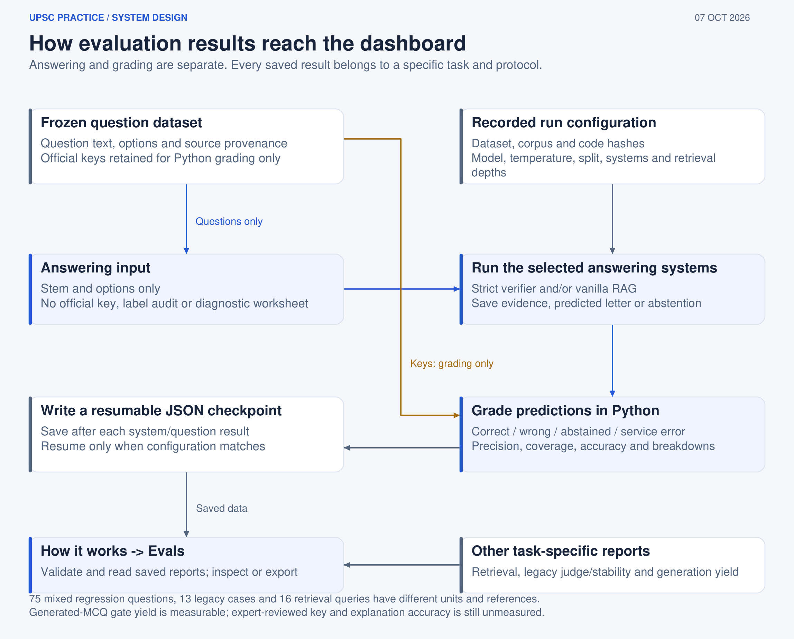

# Evaluation Studio

The Evals view is under How it works in the main Streamlit app. evals_app.py opens the same read-only dashboard on port 8502. Reading, filtering, refreshing and downloading reports make no model calls.

The dashboard separates:

| View | Evidence |
|---|---|
| Overview | Report availability, sources and metric definitions |
| Task specification | Inputs, outputs, unit of analysis and grading contract |
| Answer quality | Correct, wrong, abstained, errors, coverage and precision |
| RAG / Retrieval | Actual practice queries plus the 16-query page benchmark |
| Grounding & faithfulness | Citation presence, verdict traces and historical judge results |
| Generation | Acceptance, revisions, rejected candidates and blocking gates |
| Stability | Repeated legacy verdicts and changed claims |
| Reports | Snapshots, metadata, downloads and reproduction commands |

The dashboard labels the 75-question files as regression results and labels legacy 13-question and generation reports by their original protocol. It does not invent a score when a file is missing, incomplete or incompatible with the current code.

Run it with:

    .venv/bin/python -m streamlit run app.py
    .venv/bin/python -m streamlit run evals_app.py --server.port 8502

The retrieval report can be regenerated without an LLM:

    .venv/bin/python -m src.evaluation.evaluate_retrieval

The UI shows actual top-20 candidates, reranked selections, expanded pages, source references, timings and usage when a current practice run contains those traces. Bank reuse has no new trace. Earlier records without instrumentation are marked unavailable rather than reconstructed.
