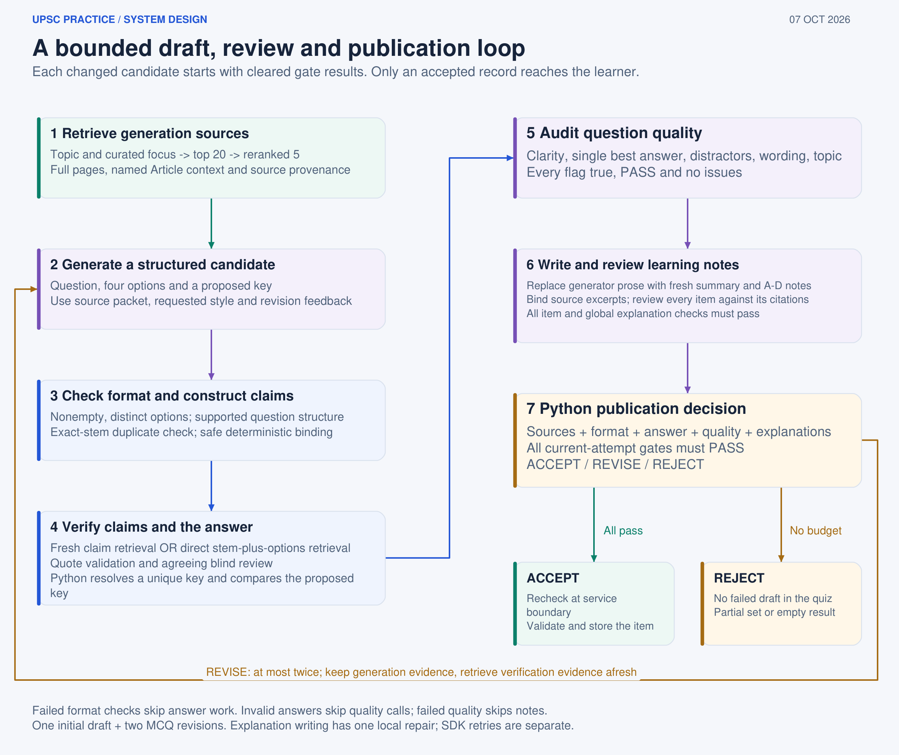

# Practice design

The learner flow is deliberately simple: choose a static Polity topic, practise, submit, and then inspect the checked reasoning.

## Learner contract

Practice offers direct, statement and mixed formats, requested Foundation, Standard or Challenging difficulty, and sets of 1, 5 or 10. Difficulty is a prompt setting; it has not been calibrated against learner performance. Only accepted questions appear. Before submission the UI hides the key, summary and option explanations.

After submission the UI shows the score, skipped items, the checked key, a summary, an explanation for A-D and the exact source quotations used by the record. My Practice keeps the latest 20 completed sets and a mistake notebook in the current server session.

## Preparation flow

An eligible bank record is reused when its topic, format, requested difficulty, corpus hash and generation policy match. Otherwise the service retrieves a topic-focused source packet, asks the generator for a structured candidate, and runs the checks in order.

Numbered statements use deterministic parsing and per-claim verification. Direct questions use stem-plus-option retrieval and independent option comparison. The answer key supplied by the generator is compared with the independently resolved answer. The quality auditor and explanation reviewer run only after the answer stage passes.

Every failed candidate is revised with explicit failure reasons within the fixed budget. Each revision clears all previous gate state. A failure after the budget produces no draft in the quiz. A request can therefore return a partial set.

## Evidence shown after submission

The app records source, document, page, chunk and quotation references. The learner sees the checked excerpts and page numbers, while the underlying diagnostics retain retrieval candidates, reranking scores, expanded pages, stage durations and model usage. Reusing a bank question creates no new retrieval or model trace.

## Why this scope is useful

Static Polity gives the capstone a bounded source surface and a clear correctness question. It still exercises real reliability problems: exceptions, footnotes, multi-statement truth patterns, distractor quality and insufficient evidence. Expansion to other subjects should wait until each subject has reviewed sources and its own evaluation set.
