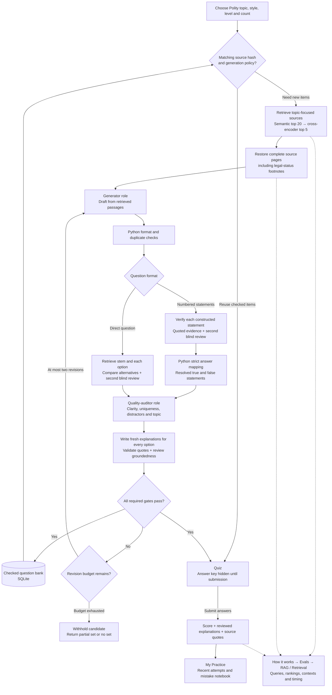

# UPSC Practice system design

The learner chooses a static Polity topic, attempts a generated quiz and reviews the
answer with source quotations. The system publishes a question only when all
required automated checks complete successfully. Other subjects remain locked
until their sources and verification paths are ready.

The learner UI has three sidebar pages: Practice, My Practice and How it works.
Verification runs automatically within question preparation. Standalone
verification remains available through the CLI for offline development work.

This describes the current implementation. Historical verification benchmarks
and earlier generation experiments are separate measurements; their accuracy
does not transfer to newly generated questions.

The capstone prioritises useful static practice and measured correctness of
released questions and explanations. The mixed 75-question regression set is
a diagnostic rather than a perfect-score target. Generated-question evaluation
must also assess ambiguity, source support, topic/style fit, delivery yield,
latency and cost. Unresolved drafts continue to be revised or withheld.

## Overall flow



The diagram shows the required checks. A failed format check skips expensive
answer work; a failed answer check skips quality and explanation work. Missing
or skipped checks cannot pass the final publication gate. Revisions retain the
generation source packet but retrieve evidence afresh for verification.
Explanation writing has one local repair attempt for the same checked MCQ;
all explanation checks run again before a PASS. If both attempts fail, the
candidate enters the usual bounded MCQ revision loop.

## What learners see

| UI area | Behaviour |
|---|---|
| Practice | Polity open; four other subjects locked. Choose a topic, direct/statements/mixed style, requested level and 1/5/10 questions. The home page focuses on the quiz. |
| Active quiz | Only accepted questions appear. No answer is preselected, and no key or draft explanation is displayed before submission. |
| Submitted quiz | Correct/incorrect/skipped counts, explanations for A–D, and exact source quotations with PDF page references. |
| My Practice | The latest 20 completed sets in Streamlit server memory for the current session; incorrect and skipped questions can be revisited. |
| How it works → About this site | A plain-language walkthrough of practice, retrieval, verification, explanation checks and the current source scope. |
| How it works → Privacy & PII | Data minimisation, session/server storage, outgoing model inputs and explicitly missing privacy controls. |
| How it works → Guardrails | Five mandatory publication checks, Python/model enforcement, failure examples, bounded revisions, safe bank reuse and the limits of automated review. Viewing it makes no model calls. |
| How it works → Evals | Read-only saved verification benchmarks and generation experiments. Current generation reports require matching source and policy metadata; older experiments are labelled historical. |
| How it works → Evals → RAG / Retrieval | Per-question/draft queries, actual semantic candidates and reranking, expanded source evidence, final quotations and a separate source-page retrieval benchmark. Active quiz details unlock after submission. |
| How it works → System design | Current architecture image, component responsibilities and the choices' benefits/limitations. |
| How it works → Error handling | Evidence failures versus service failures, bounded recovery, partial sets and source changes. |
| How it works → Cost & latency | Real elapsed time, stage durations, model calls, token usage, dated model-cost estimates, reuse and revisions. Inspecting the view makes no model calls. |

Sidebar navigation preserves setup choices and unfinished answers. Quiz choices
are saved to session state on selection; scoring and answer explanations remain
hidden until the learner clicks Submit. Diagnostic views render only when opened.

Practice levels are requested prompt settings, not empirically calibrated
difficulty scores. Partial sets contain only accepted items; a request for
five questions can return fewer if the other candidates fail checks.

## Sources and retrieval

The approved corpus is `data/processed/chunks.jsonl`: Constitution of India
text plus a limited NCERT Grade 7 introductory Constitution chapter. It is not
a complete Polity textbook or an unrestricted web corpus. Missing coverage
results in withheld questions rather than a web-search fallback.

`ClaimRetriever` uses semantic embeddings, selects 20 candidate chunks and
cross-encoder reranks to five. `PageEvidenceContext` restores source pages so
qualifications and legal-status footnotes are not cut out of the evidence.
Generation uses the selected topic and a rotating curated focus query. Direct
verification retrieves for the stem and each alternative, then deduplicates
the pages. Generation and statement verification also use explicitly named
Articles to look up their operative/omitted headings in the approved Constitution.
This adds the provision's source pages, continuation and footnotes alongside the
ranked passages; it never supplies a verdict. The saved RAG trace identifies these
additional pages separately from the top-five ranking. Statement verification
retrieves separately for each constructed claim; recognized literal absence
claims use the existing corpus-scan path.

Practice statement reviewers select numbered quotation references. Python copies
the original source words and validates their page/provenance. A separate blind
review must agree on the complete proposition. Unknown references, disagreement
or unresolved scope still withhold the question; an exact quote alone does not
prove the claim. New runs of the 75-question benchmark use the same quotation
references, blind reviews and per-claim Article context. The full benchmark
reports saved on 3 October used the earlier interface and do not evaluate these
changes. The separate 13-question regression runner retains its original interface.

Direct verification also rejects a committed judgment when its exact quotations
share no informative question/option terms. This screens wholly unrelated
citations; overlapping words do not prove that a passage supports an answer, and
synonyms can cause unnecessary abstention. Blind semantic review remains required.
Practice policy `source-grounded-practice-v4` prevents reuse of questions accepted
under the earlier policy; those bank records remain stored for historical review.

Retrieved passages are evidence data, not instructions. Model-call telemetry
does not store prompts or credentials. The requested retrieval diagnostics
retain approved-source queries, chunk excerpts, rankings, expanded page
context and timings. Question records retain the evidence needed to show
their reviewed explanations. Reuse records no new retrieval calls, and
earlier runs without traces are not reconstructed.

## Roles and Python controls

LangGraph coordinates bounded model roles. These are task-specific steps in a
workflow, not an autonomous agent with browsing or file-writing privileges.

| Component | Input | Output / authority |
|---|---|---|
| Source retriever | Topic and curated focus | Approved passages. No passages means generation cannot start. |
| Generator | Source packet, format, level, duplicate list and revision feedback | Structured candidate MCQ. Its key and explanation remain untrusted. |
| Format checker | Candidate stem and options | Four distinct nonempty options; format match; supported statement structure; duplicate checks. |
| Statement verifier | One constructed claim and retrieved pages | SUPPORTED / CONTRADICTED / INSUFFICIENT with matching quotations and a second blind model review. |
| Strict answer mapper | Statement verdicts and option text | A unique letter in Python, or unresolved. A false statement is valid when the answer's truth pattern is correct. |
| Direct verifier | Exact stem, A–D and retrieved pages | One supported answer and three ruled-out alternatives; the second blind assessment must agree. Missing evidence does not rule out an alternative. |
| Quality auditor | Question, options and topic, without the declared key | Every quality flag true, PASS verdict and no issues. A PASS label alone is insufficient. |
| Explanation writer/reviewer | Verified answer and checked evidence | Fresh summary and explanation for each option, validated quotations, and a separate review of each explanation against its own cited pages and quotes. Every item and every global check must PASS. Draft generator prose is discarded. |
| Publication gate | All current-attempt results | ACCEPT / REVISE / REJECT. Every required check must pass. |

Every revision clears previous answer, fact, quality and explanation results.
A PASS from an earlier attempt cannot approve a changed question. The maximum
is one draft plus two revisions per requested slot, independent of bounded
SDK transport retries.

Review calls hide the declared answer where appropriate. The second reviews
use the same model family; agreement is useful evidence but not independent
human adjudication, and correlated model mistakes remain possible.

The practice direct verifier and explanation writer select numbered excerpts from the checked source
pages. Python binds those references to the original text and page metadata;
the model cannot supply a new quotation string. Unknown references fail before
review. The separate reviewer still checks whether each selected excerpt
actually supports its explanation, with the complete cited page available for
qualifications and legal-status footnotes.
Direct assessments use four required schema fields for A–D; Python supplies
their labels and binds source references before resolving an answer.

For literal Article-number lookups, Python can produce concise explanations
when the full rule in the question matches the selected Article's source
passage. These explanations compare the option values with the identified
provision and add no claims about other Articles. They still require the same
separate per-item explanation review. Other questions use the bounded writer
and repair path.

## Publication and storage contracts

`PracticeQuestion` requires:

- A supported Polity topic and structured four-option MCQ.
- All five publication gates: sources, format, answer, quality and explanations.
- A reviewed summary plus one cited explanation for each of A–D, with correct
  option flags. An explanation that merely repeats its option is rejected.
- Quotations that occur in the recorded source text and valid page metadata.
- The corpus SHA-256, generation-policy version and creation timestamp.
- A content-derived record ID, checked again when loading a saved question.

`question_from_state()` rechecks the terminal gate before building the record.
SQLite stores accepted questions separately from versioned run reports.
Normalized stem fingerprints prevent exact wording duplicates; semantic
duplicate detection is not implemented. The bank is reusable only within the
same topic, format, requested difficulty, source hash and policy version.

The source hash is checked before publication and again before displaying or
submitting a quiz. A changed corpus retires the active quiz and excludes older
bank records from reuse. Records with corrupted payloads or invalid quotations
are skipped. This detects accidental corruption, not malicious modification
by someone with write access to the local database.

## Failure behaviour

| Condition | Result |
|---|---|
| No source passages / malformed structured response | Candidate is withheld. No ungrounded generation fallback. |
| Unresolved statement or competing direct options | No accepted answer; revise within budget, otherwise withhold. |
| Blind reviews disagree / citation does not match | The judgment remains unresolved and cannot publish. |
| Quality FAIL with empty issues / PASS with a false flag | Publication fails. |
| Missing option explanation / ungrounded prose / failed explanation review | Publication fails even if the answer check passed. |
| API, timeout or connection failure | Stop the batch; return any already accepted items. Telemetry records the error class without provider messages or credentials. |
| Source snapshot changes during a run | Retire the in-flight practice set and require fresh checks. |
| Some requested questions fail | Return the smaller accepted set and show its actual size. |

## Evaluation and observability

Offline behavioural tests exercise publication boundaries, wrong keys,
unresolved distractors, review disagreement, bad quotations, failed quality
flags, retries, source changes, record corruption, answer hiding and reuse.
These tests establish control behaviour with synthetic model responses, not
the accuracy of real generated questions.

`evaluate_generation_loop.py` captures per-attempt source, format, fact,
answer, quality and explanation checks. Current reports go to
`generation_grounded_results.json` and its statement-format counterpart.
Historical `generation_loop_results*.json` files are preserved. Reports carry
the corpus hash and policy; a source change during evaluation prevents the UI
from presenting them as current.

```bash
# Offline checks
.venv/bin/python -m pytest -q

# Source-page retrieval benchmark; local models, no LLM API calls
.venv/bin/python -m src.evaluation.evaluate_retrieval

# One topic; paid model calls, current source-grounded workflow
.venv/bin/python -m src.evaluation.evaluate_generation_loop --format simple --limit 1

# A single practice question using the same publication service as the UI
.venv/bin/python -m src.orchestration.run_workflow --topic "Fundamental Duties" --max-retries 0
```

Acceptance, first-attempt block rate and repair rate describe the workflow's
own judgments. They do not measure true correctness. A future generated-MCQ
benchmark should freeze questions and sources, obtain expert labels for the
key and each option explanation, and report correctness, ambiguity, coverage
and errors across repeated runs separately from latency and model usage.

## Current deployment and limits

The application is a local Streamlit process with cached retrieval models and
SQLite persistence. Learner attempts remain in Streamlit server session memory. There
are no user accounts, cross-device history, background job queue or multiuser
production isolation. Browsing the UI or evaluation reports does not initialize
retrieval models or spend model tokens.

Before a student release, review a substantial generated sample with a Polity
expert, expand source coverage carefully, and establish a fresh correctness
benchmark. Quotation checks prove that quoted text exists; they do not prove
entailment or that the corpus is complete and legally current. Automatic checks
cannot promise that no wrong answer will ever pass.
