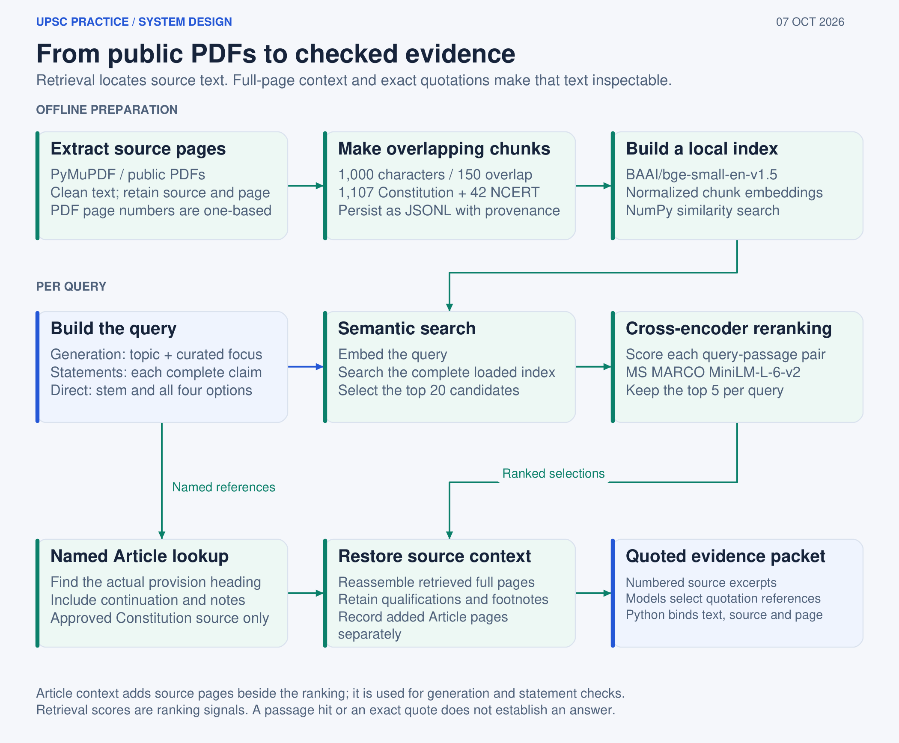
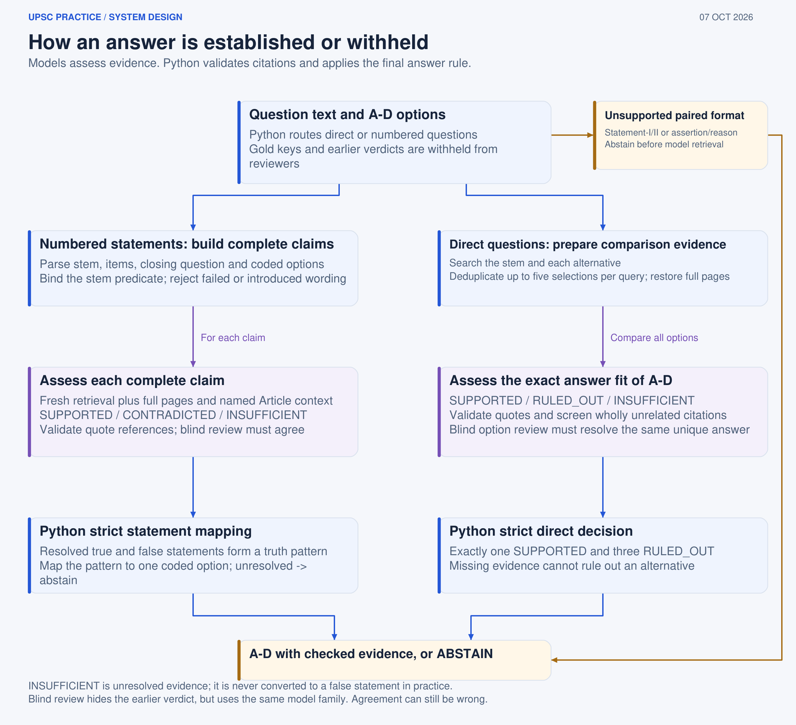
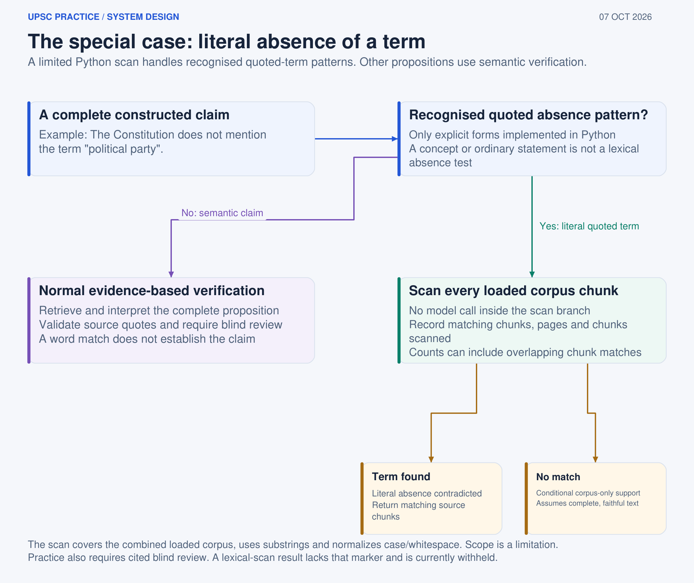
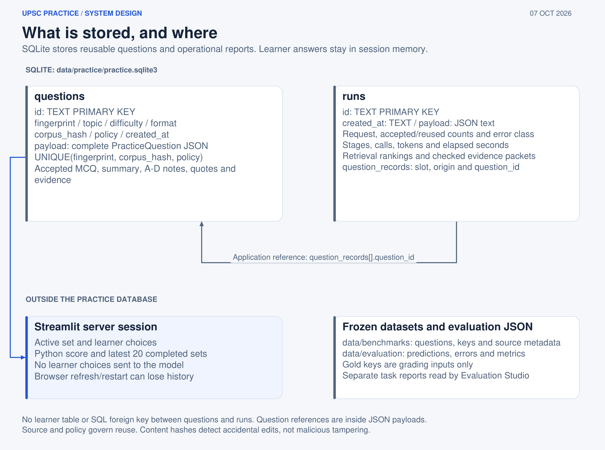

# System Design

This document is the canonical technical description of **UPSC Practice**: what the components are, what each component promises, how data moves through the system, and what happens when something fails.

It is written to be readable without prior knowledge of the codebase. Each section identifies the module responsible for the behaviour it describes.

- For **why** the system is shaped this way, see [`../DESIGN.md`](../DESIGN.md).
- For installation and usage, see [`../README.md`](../README.md).
- For historical verifier experiments and measurements, see [`../EVALUATION.md`](../EVALUATION.md).

---

## 1. System Overview


The system has four major phases:

1. **Preparation** — performed offline; PDFs become a page-aware, hashed collection of text chunks.
2. **Retrieval** — performed for each question and verification step; a query is converted into relevant evidence.
3. **Generation and verification workflow** — performed per question; a fixed eight-stage graph generates and attempts to disprove a candidate MCQ before publication.
4. **Persistence and evaluation** — accepted questions, run telemetry, and evaluation reports are stored for reuse and analysis.

Three invariants govern the architecture.

> **Generation cannot start without retrieved evidence.**

This is enforced in code rather than relying on a prompt instruction.

> **A retrieved passage is evidence, never a verdict.**

Retrieval establishes relevance. It does not establish truth.

> **Python makes terminal decisions.**

Models generate structured content and assessments; deterministic application code decides whether those assessments satisfy the publication contract.

---

# 2. Components

| Layer | Implementation | Responsibility |
|---|---|---|
| UI | `app.py`, `src/ui/` | Practice, My Practice, and read-only documentation pages |
| Evaluation UI | `evals_app.py`, `src/ui/evaluations.py` | Saved reports, benchmarks, and diagnostics |
| Source preparation | `src/ingestion/` | PDF extraction, cleaning, page-aware chunking |
| Retrieval | `src/retrieval/`, `src/verification/article_context.py` | Semantic retrieval, reranking, page restoration, Article-specific context |
| Generation | `src/generation/mcq_generator.py` | Structured candidate MCQ generation |
| Orchestration | `src/orchestration/` | Fixed LangGraph workflow, state, revision budget, gates, telemetry |
| Verification | `src/verification/` | Claim parsing, fact checking, direct-option verification, quality review, citation binding, explanation review |
| Practice contracts | `src/practice/` | Request/question models, service boundary, persistence, cost estimation |
| Evaluation | `src/evaluation/` | Benchmarks, baselines, graders, regression checks |

### Recommended reading order

For a developer new to the codebase:

```text
src/practice/models.py
        ↓
src/orchestration/graph.py
        ↓
src/orchestration/nodes.py
        ↓
src/retrieval/retrieval_config.py
```

This moves from:

```text
What is a valid question?
        ↓
What is the workflow?
        ↓
What does each stage do?
        ↓
What retrieval configuration does it use?
```

---

# 3. Source Preparation

The source pipeline converts the project corpus into page-aware chunks.

PyMuPDF extracts the Constitution of India and the selected NCERT Grade 7 chapter **page by page**.

Keeping page boundaries during ingestion is important because later verification needs to identify the exact source location of evidence.

## Chunk configuration

| Property | Value | Purpose |
|---|---:|---|
| Chunk size | 1,000 characters | Large enough to contain useful provisions |
| Overlap | 150 characters | Reduces information loss at chunk boundaries |
| Metadata | source, document, page, chunk index | Makes evidence traceable |
| Active corpus | 1,149 chunks | 1,107 Constitution + 42 NCERT |

The active corpus is written to:

```text
data/processed/chunks.jsonl
```

Each chunk retains enough metadata to reconstruct its source location.

---

## Corpus identity

The processed corpus receives a SHA-256 hash.

That hash is recorded with:

- saved questions;
- evaluation reports; and
- other persisted artifacts that depend on the corpus.

This allows the system to distinguish:

```text
Question generated against corpus A
```

from:

```text
Question generated against corpus B
```

even when the question text itself is identical.

### Known defect

The hash is currently computed over raw bytes.

Therefore, line-ending differences can change the hash:

```text
LF   → one hash
CRLF → another hash
```

even when the logical text is identical.

This can cause evaluation freshness checks to report a changed corpus after a Windows checkout.

The content itself is unaffected.

A future fix would normalise line endings before hashing.

---

# 4. Retrieval Contract



Retrieval has two primary stages:

```text
Query
  ↓
Semantic candidate selection
  ↓
20 candidates
  ↓
Cross-encoder reranking
  ↓
5 candidates
  ↓
Context expansion
```

## 4.1 Candidate selection

The semantic retriever uses:

```text
BAAI/bge-small-en-v1.5
```

The query and corpus chunks are embedded.

The corpus embeddings are stored in a normalised NumPy matrix.

Because the vectors are unit-normalised:

```text
dot product = cosine similarity
```

Therefore candidate retrieval can be performed using ordinary matrix multiplication without requiring a vector database.

The initial retrieval depth is:

```text
RERANK_CANDIDATE_K = 20
```

---

## 4.2 Reranking

The 20 semantic candidates are scored using:

```text
cross-encoder/ms-marco-MiniLM-L-6-v2
```

Unlike a bi-encoder embedding model, the cross-encoder reads:

```text
(query, chunk)
```

together.

This is more computationally expensive but allows a more discriminating relevance score.

The final retrieval depth is:

```text
RETRIEVAL_TOP_K = 5
```

Both constants live in:

```text
src/retrieval/retrieval_config.py
```

The production pipeline and evaluation code import the same configuration.

This prevents the benchmark from measuring one retrieval depth while production uses another.

---

# 5. Context Expansion

The top-ranked chunks are not necessarily sufficient by themselves.

Constitutional provisions can contain:

- provisos;
- exceptions;
- continuation text;
- footnotes; and
- related material elsewhere on the same page.

The system therefore expands the ranked evidence.

## Page evidence

`PageEvidenceContext` restores the complete page associated with a retrieved chunk.

```text
Retrieved chunk
      ↓
Original page
      ↓
Complete page evidence
```

This reduces the chance that a chunk boundary removes a qualification from the context.

## Article evidence

`ArticleEvidenceContext` in:

```text
src/verification/article_context.py
```

can additionally include:

- operative provision pages;
- continuation pages;
- relevant footnotes.

This is particularly useful when a generated question explicitly references a constitutional Article.

---

## Ranked vs expanded evidence

Expanded pages remain distinguishable from ranked retrieval results.

This is intentional.

A page added because of Article-aware expansion must not be confused with:

> "The retriever ranked this passage in its top five."

This preserves the distinction between:

```text
retrieval evidence
```

and:

```text
context added for completeness
```

---

# 6. Retrieval Happens More Than Once

Retrieval is not performed only when generating the initial question.

Different stages issue their own retrieval calls.

For example:

```text
Generation
    ↓
retrieve sources

Claim verification
    ↓
retrieve for claim 1
retrieve for claim 2
retrieve for claim 3

Direct-option verification
    ↓
retrieve for option A
retrieve for option B
retrieve for option C
retrieve for option D
```

This prevents a claim from being verified merely because some unrelated passage happened to be present during generation.

The principle is:

> **A claim should be checked against evidence retrieved for that claim.**

---

# 7. Generation Contract


The application uses a fixed LangGraph workflow.

The graph cannot dynamically add, remove, or reorder stages.

```text
retrieve_sources
      ↓
generate_mcq
      ↓
extract_claims
      ↓
verify_claims
      ↓
verify_answer_key
      ↓
audit_quality
      ↓
explain_question
      ↓
decide
```

The final `decide` stage has three possible outcomes:

```text
REVISE
ACCEPT
REJECT
```

`REVISE` returns to candidate generation.

`ACCEPT` and `REJECT` terminate the workflow.

---

# 8. Workflow Stages

| Stage | Responsibility |
|---|---|
| `retrieve_sources` | Builds the evidence packet. If no evidence is retrieved, generation cannot proceed. |
| `generate_mcq` | Generates one structured candidate containing a stem, four options, proposed key, and rationale. |
| `extract_claims` | Converts statement-style questions into standalone propositions. |
| `verify_claims` | Retrieves evidence for each claim and assigns `SUPPORTED`, `CONTRADICTED`, or `INSUFFICIENT`. |
| `verify_answer_key` | Uses deterministic truth-pattern mapping for statement questions or option comparison for direct questions. |
| `audit_quality` | Checks clarity, uniqueness, distractor quality, wording, and topic fit. |
| `explain_question` | Generates the learner-facing explanation and validates each option note against evidence. |
| `decide` | Determines whether all publication gates have passed. |

The candidate generated by `generate_mcq` is **untrusted input**.

No generation result is published simply because the model returned valid structured output.

---

# 9. Revision Budget

The generation loop is deliberately bounded.

A request receives:

- one initial candidate;
- at most two MCQ revisions;
- one local explanation repair.

The maximum MCQ retry count is controlled by the request contract.

An unlimited retry loop would make an unresolved question capable of consuming unlimited model calls.

More importantly, repeated rewriting can create selection pressure toward wording that happens to pass the checks rather than wording that is genuinely better supported.

The intended behaviour is:

```text
Generate
   ↓
Verify
   ↓
Repair
   ↓
Verify again
   ↓
Abstain if unresolved
```

---

# 10. Revision State Reset

A revision creates a new candidate.

All previous gate results are discarded.

For example, the following state is invalid:

```text
Draft A
  sources   ✓
  answer    ✓
  quality   ✗

Draft B
  quality   ✓

→ ACCEPT
```

The system instead performs:

```text
Draft A
  ↓
discard all gate state
  ↓
Draft B
  ↓
run every required gate again
  ↓
ACCEPT / REJECT
```

This prevents a final question from being published using a combination of verification results that never applied to the same draft.

---

# 11. Publication Contract

The required publication gates are defined centrally in:

```text
src/practice/models.py
```

The required set is:

```text
sources
format
answer
quality
explanations
```

Conceptually:

```text
Candidate
   │
   ├── sources ✓
   ├── format ✓
   ├── answer ✓
   ├── quality ✓
   └── explanations ✓
          │
          ▼
       ACCEPT
```

Every gate is mandatory.

A question with:

```text
4 / 5 gates passed
```

is not partially publishable.

It is rejected or revised.

The publication contract also requires the recorded gate set to match the required set exactly.

---

# 12. Storage Boundary Revalidation

The workflow's final decision is not trusted blindly by the persistence layer.

Before saving a question:

```text
src/practice/service.py
```

revalidates the complete `PracticeQuestion` against the terminal publication contract.

This creates a second protection boundary:

```text
LangGraph
    ↓
Terminal decision
    ↓
Service validation
    ↓
SQLite
```

The database therefore cannot receive an invalid question merely because an orchestration bug incorrectly marked it as accepted.

---

# 13. Verification Contract



Verification has different paths depending on the question type.

---

## 13.1 Statement Questions

A statement-based question follows this sequence:

```text
Question
   ↓
Parse statements
   ↓
Build standalone claims
   ↓
Retrieve per claim
   ↓
Fact verification
   ↓
Quotation validation
   ↓
Blind review
   ↓
Deterministic answer mapping
```

### Step 1 — Parse

`question_parser.py` identifies the individual statements.

### Step 2 — Build claims

`claim_builder.py` converts each statement into a complete proposition.

For example:

```text
"It is appointed by the President."
```

may become:

```text
"The Governor of a State is appointed by the President."
```

The actual transformation depends on the generated question context.

The important requirement is that each claim can be evaluated independently.

### Step 3 — Retrieve

`claim_retriever.py` retrieves evidence specifically for each claim.

### Step 4 — Verify

`fact_verifier.py` assigns:

```text
SUPPORTED
CONTRADICTED
INSUFFICIENT
```

and returns a quotation.

### Step 5 — Validate the quotation

`source_quotes.py` checks that the quotation actually exists in the cited passage.

### Step 6 — Blind review

An independent review must agree with the verification outcome.

### Step 7 — Derive the answer

Python maps the final truth-value pattern to the coded answer option.

The model does not make this final decision.

---

# 14. Meaning of the Three Claim Verdicts

| Verdict | Meaning | Publication effect |
|---|---|---|
| `SUPPORTED` | Evidence supports the claim | Resolves the claim as true |
| `CONTRADICTED` | Evidence establishes the opposite | Resolves the claim as false |
| `INSUFFICIENT` | Evidence does not settle the claim | Blocks publication |

`CONTRADICTED` is not an error.

False statements are required for many MCQ formats.

`INSUFFICIENT`, however, means the system cannot safely determine the truth value.

Therefore:

```text
SUPPORTED      → usable
CONTRADICTED   → usable
INSUFFICIENT   → unresolved
```

---

# 15. Direct MCQ Verification

Direct questions such as:

> Which of the following is correct?

cannot use the statement-truth-pattern mechanism.

Instead, the system evaluates all four options.

The direct verification contract requires:

1. exactly one supported option;
2. three alternatives positively ruled out;
3. valid evidence quotations;
4. agreement from an independent blind review.

The crucial rule is:

> **Missing evidence cannot prove an alternative false.**

Therefore:

```text
Option A → supported
Option B → no evidence
Option C → no evidence
Option D → no evidence
```

is unresolved.

It is not equivalent to:

```text
A = true
B = false
C = false
D = false
```

Silence is not contradiction.

---

# 16. Literal Absence Verification



Some generated claims concern the literal absence of a term.

For example:

> "The term X does not appear in the Constitution."

Retrieval cannot establish this because retrieving the top five chunks does not tell us whether the term appears in the remaining corpus.

The absence checker therefore scans every loaded chunk.

Implemented in:

```text
src/verification/negative_claim_checker.py
```

The result is:

| Outcome | Meaning |
|---|---|
| A literal match is found | The absence claim is contradicted |
| No literal match is found | Literal absence is supported, subject to corpus and extraction assumptions |

This does **not** establish conceptual absence.

A string scan can answer:

```text
"Does this exact text appear?"
```

It cannot reliably answer:

```text
"Does this idea appear?"
```

---

# 17. Quality Gate

After factual verification, the candidate is evaluated as a question.

The quality audit checks:

- clarity;
- exactly one defensible answer;
- distractor plausibility;
- wording;
- topic relevance;
- requested question style;
- requested difficulty;
- absence of avoidable ambiguity.

This gate exists because factual correctness and question quality are different properties.

A question can be factually grounded and still be a poor MCQ.

---

# 18. Explanation Generation

The explanation stage happens only after the answer has been established.

The explanation writer receives source material but does not receive the earlier verification reasoning.

It produces:

- a summary explanation;
- an explanation for the correct option;
- an explanation for each incorrect option.

A second reviewer checks the generated explanations against their cited excerpts.

One local repair is allowed.

The intended flow is:

```text
Verified question
       ↓
Fresh explanation writer
       ↓
Explanation review
       ↓
Repair if necessary
       ↓
Explanation gate
```

---

# 19. Persistence Model



SQLite contains two primary tables.

| Table | Contents |
|---|---|
| `questions` | Question content, corpus hash, generation policy, gate results, validated payload |
| `runs` | Request metadata, stage measurements, model usage, retrieval traces, produced question records |

---

# 20. What Is Not Persisted

Several pieces of data intentionally remain outside durable storage.

### Learner answers

Learner answers and scores exist only in Streamlit session state.

They are not written to SQLite.

### Dataset answer keys

Evaluation answer keys are grading inputs.

They are never passed into prompts.

This prevents benchmark leakage.

### User accounts

The application does not implement a user-account model.

It is designed as a single-user local application.

---

# 21. Question Reuse

Accepted questions can be reused when the relevant generation context has not changed.

The database enforces:

```text
UNIQUE(fingerprint, corpus_hash, policy)
```

Therefore a question is reusable only if:

- its fingerprint matches;
- the corpus hash matches;
- the generation policy matches.

If the corpus or policy changes:

```text
Old question
     ↓
Still stored
     ↓
No longer eligible for reuse
```

Records are retired rather than deleted.

This preserves historical references in reports.

---

# 22. Evaluation Contract


The evaluation framework follows three core rules.

## 22.1 No answer-key leakage

The answering system receives only:

- question text;
- answer options.

The official answer key is not included in the prompt.

---

## 22.2 Python performs grading

Models do not grade their own answers.

The evaluation runner produces predictions.

Python compares those predictions with the frozen answer key afterward.

```text
Question
   ↓
Answering system
   ↓
Prediction
   ↓
Python grader
   ↓
Metric
```

---

## 22.3 Every result has provenance

Evaluation reports record enough metadata to identify the configuration that produced them, including:

- dataset;
- corpus hash;
- code version;
- model;
- split;
- retrieval configuration;
- relevant metadata.

This prevents an isolated number from becoming detached from the experiment that produced it.

---

# 23. Offline Evaluation

`--check` modes validate frozen inputs and cross-report consistency without making model calls.

This enables:

- local regression checks;
- CI;
- reproducibility checks;
- validation without an API key.

The evaluation system therefore distinguishes between:

```text
Offline structural validation
```

and:

```text
Model-dependent evaluation
```

---

# 24. What Evaluation Means

Generated-MCQ acceptance is a **workflow metric**.

It answers:

> "What proportion of generated candidates passed the system's publication gates?"

It does not answer:

> "What proportion would an expert examiner consider correct?"

The project currently does not have an expert-labelled generated-MCQ accuracy benchmark.

That is the largest open evaluation gap.

The retrieval benchmark also currently shows no measured Recall@5 improvement from reranking on the 16-query dataset:

```text
Semantic retrieval       14 / 16
Semantic + reranking     14 / 16
```

See [`../EVALUATION.md`](../EVALUATION.md) for the complete measurements and their limitations.

---

# 25. Failure Handling

The system deliberately distinguishes:

```text
ABSTENTION
```

from:

```text
OPERATIONAL FAILURE
```

This distinction matters.

A cautious system may legitimately refuse to publish a question.

A timeout is a system failure.

They should not be counted as the same outcome.

---

## 25.1 Deliberate publication blockers

| Condition | Gate |
|---|---|
| No retrieved sources | `sources` |
| Invalid structured output | `format` |
| Unsupported question format | `format` |
| Claim remains `INSUFFICIENT` | `answer` |
| Quotation cannot be found in cited passage | `answer` |
| Blind review disagreement | `answer` |
| Quality or ambiguity failure | `quality` |
| Explanation unsupported by cited excerpt | `explanations` |

These conditions cause the question to be revised or withheld.

---

## 25.2 Operational failures

Operational failures include:

- API timeouts;
- connection failures;
- SDK failures;
- unexpected runtime exceptions.

The OpenAI client is configured with:

```text
45-second timeout
1 SDK retry
```

These failures are recorded separately from deliberate abstention.

---

# 26. Corpus Changes

The corpus hash acts as a version boundary.

If the source corpus changes:

```text
New corpus hash
       ↓
Existing questions no longer match
       ↓
Old questions become ineligible for reuse
```

Historical records remain available.

This means evaluation reports can continue referring to the questions and corpus that originally produced them.

---

# 27. Cost and Runtime

The system makes multiple model calls per accepted question.

The approximate call sequence can include:

```text
Generation
   ↓
Claim verification
   ↓
Answer verification
   ↓
Quality audit
   ↓
Explanation generation
   ↓
Explanation review
```

Revisions can add additional generation and verification calls.

This is intentionally more expensive than a one-call generator.

The trade is:

```text
More calls
   +
More latency
   +
Higher cost
   ↓
More opportunities to catch unsupported output
```

Cost estimates are derived from recorded token usage.

Missing usage data is treated as incomplete rather than silently priced as zero.

A zero-cost fallback would understate the real cost.

---

# 28. Runtime Configuration

The active LLM configuration is:

```text
Model: gpt-4o-mini
API: OpenAI Responses API
Output: structured outputs
Timeout: 45 seconds
SDK retries: 1
```

Cost rates are maintained in:

```text
src/practice/costs.py
```

The application treats those figures as estimates rather than invoice totals.

Infrastructure costs are not included.

Unreported usage is not silently converted into zero cost.

---

# 29. Runbook

## Start the practice application

```bash
.venv/bin/python -m streamlit run app.py
```

## Start the evaluation dashboard

```bash
.venv/bin/python -m streamlit run evals_app.py --server.port 8502
```

## Run the test suite

```bash
.venv/bin/python -m pytest
```

## Validate the benchmark offline

```bash
.venv/bin/python -m src.evaluation.evaluate_benchmark --check
```

## Run all offline evaluation checks

```bash
.venv/bin/python -m src.evaluation.run_all --check
```

## Rebuild architecture diagrams

```bash
.venv/bin/python docs/diagrams/render_diagrams.py
```

None of the offline checks above require model calls.

On Windows, replace:

```text
.venv/bin/python
```

with:

```text
.venv\Scripts\python
```

---

# 30. End-to-End Data Flow

The complete runtime path can be summarised as:

```text
                  ┌──────────────────────┐
                  │   Practice Request   │
                  │ topic/style/diff./N  │
                  └──────────┬───────────┘
                             │
                             ▼
                  ┌──────────────────────┐
                  │  Retrieve Sources    │
                  │ 20 → rerank → 5      │
                  └──────────┬───────────┘
                             │
                             ▼
                  ┌──────────────────────┐
                  │   Generate Candidate │
                  │      MCQ             │
                  └──────────┬───────────┘
                             │
                             ▼
                  ┌──────────────────────┐
                  │   Extract Claims     │
                  └──────────┬───────────┘
                             │
                             ▼
                  ┌──────────────────────┐
                  │  Verify Claims       │
                  │ supported /          │
                  │ contradicted /       │
                  │ insufficient         │
                  └──────────┬───────────┘
                             │
                             ▼
                  ┌──────────────────────┐
                  │ Python Answer Logic  │
                  └──────────┬───────────┘
                             │
                             ▼
                  ┌──────────────────────┐
                  │   Quality Audit      │
                  └──────────┬───────────┘
                             │
                             ▼
                  ┌──────────────────────┐
                  │ Explanation Writer   │
                  └──────────┬───────────┘
                             │
                             ▼
                  ┌──────────────────────┐
                  │ Explanation Review   │
                  └──────────┬───────────┘
                             │
                             ▼
                    ┌─────────────────┐
                    │  Five Gates OK? │
                    └───────┬─────────┘
                            │
                 ┌──────────┴──────────┐
                 │                     │
                YES                   NO
                 │                     │
                 ▼                     ▼
             PERSIST               REVISE
                 │                     │
                 ▼                     │
             PUBLISH              or ABSTAIN
```

The key property of this flow is that **generation is never the terminal decision**.

The terminal decision belongs to the deterministic publication contract.

---

# 31. Design Guarantees and Non-Guarantees

The architecture guarantees certain mechanical properties.

### Guaranteed by design

- Generation cannot begin without retrieved evidence.
- Claims can remain unresolved through an explicit `INSUFFICIENT` state.
- The final answer key is derived by application logic.
- Required publication gates are explicit.
- Gate state is reset on revision.
- Evidence quotations are checked against cited passages.
- Direct-question alternatives cannot be rejected merely because evidence was not found.
- Literal-absence claims can trigger exhaustive corpus scanning.
- Corpus changes invalidate reuse eligibility.
- Evaluation answer keys are not supplied to the answering system.

### Not guaranteed

- Zero hallucinations.
- Perfect logical entailment.
- Perfect question quality.
- Perfect retrieval.
- Expert-level UPSC validity.
- Independence from model-family blind spots.
- Accuracy outside the loaded corpus.
- Correctness when source extraction itself is wrong or incomplete.

This distinction is fundamental.

The architecture reduces specific classes of failure.

It does not turn an LLM into a formally verified theorem prover.

---

# 32. Related Documents

| Document | Purpose |
|---|---|
| [`../DESIGN.md`](../DESIGN.md) | Design rationale, trade-offs, and rejected alternatives |
| [`PRACTICE_DESIGN.md`](PRACTICE_DESIGN.md) | Learner-facing product contract |
| [`ARCHITECTURE_DIAGRAMS.md`](ARCHITECTURE_DIAGRAMS.md) | Diagram definitions, conventions, and rebuild instructions |
| [`../EVALUATION.md`](../EVALUATION.md) | Evaluation measurements and limitations |
| [`retrieval_baseline.md`](retrieval_baseline.md) | Retrieval benchmark and retriever comparison |
| [`rag_baseline.md`](rag_baseline.md) | Vanilla-RAG comparison protocol |
| [`PROJECT_BRIEF.md`](PROJECT_BRIEF.md) | Complete project map |

---

# 33. Summary

The system is intentionally conservative.

Its central architecture is:

```text
Retrieve
   ↓
Generate
   ↓
Decompose
   ↓
Verify
   ↓
Derive
   ↓
Audit
   ↓
Explain
   ↓
Verify again
   ↓
Publish or abstain
```

The important engineering decision is not any individual model.

It is the separation of responsibilities:

> **Retrieval finds evidence. Models interpret evidence. Python enforces contracts. Persistence stores only validated results. Evaluation measures the system without giving it the answers.**

That separation is what allows the application to make a narrower but more defensible claim:

> **A question is not published merely because an LLM can write it. It must first satisfy the system's evidence and verification contract.**