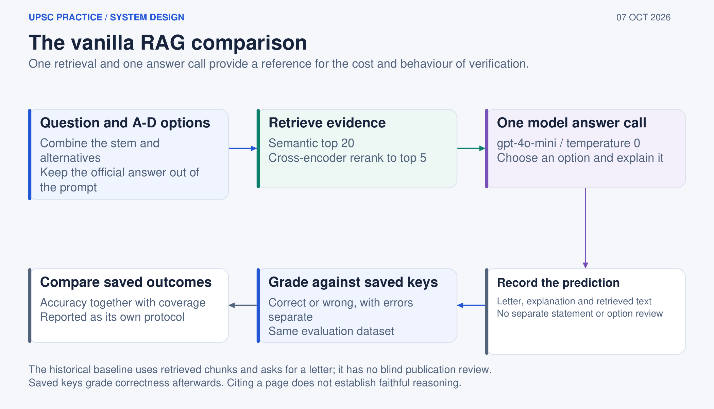

# Vanilla RAG baseline

The baseline is a comparison protocol: retrieve once, ask the model to select an option and record the answer. It does not run claim decomposition, blind publication review or a generation gate.

It uses the same semantic top-20 and cross-encoder top-five retrieval configuration as the source-verifier comparison. The model receives the question, options and retrieved evidence, but not the official answer key. Python grades the saved prediction after the call.

The baseline is useful because it measures the cost of adding verification. It always attempts a completed question, so its coverage is high but its answer may be unsupported. Its historical scores belong to the 13-question regression protocol and must not be mixed with the current practice generation workflow.
